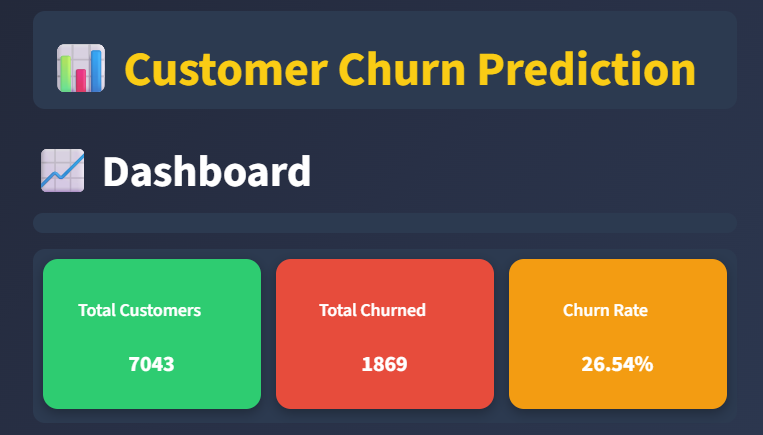
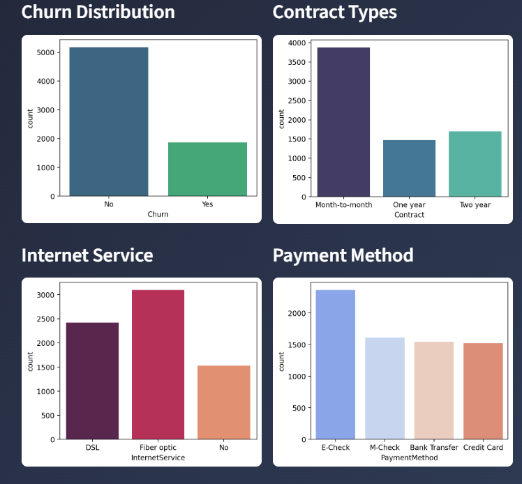

📊 Customer Churn Prediction App

A Streamlit web application for predicting telecom customer churn using the Telco Customer Churn dataset. The app provides an interactive dashboard, machine learning model training, and real-time prediction for new customers.

🚀 Features

Interactive Dashboard
KPIs: Total Customers, Total Churned, Churn Rate
Charts: Churn Distribution, Contract Types, Internet Service, Payment Methods
Model Training
Train an XGBoost Classifier
Visualize results with a confusion matrix
Save the trained model (churn_model.pkl)
Predict Churn
Input customer details (tenure, contract, charges, etc.)
Get prediction result (Yes/No) with probability score
Modern UI
Gradient background, styled KPI cards, dark theme

📂 Project Files

├── app.py # Main Streamlit app 
├── Telco-Customer-Churn.csv # Dataset 
├── churn_model.pkl # Trained model (generated after training) 
├── README.md # Project documentation

⚙️ Installation

1. Clone the repository
2. Install dependencies
3. Run app.py

📸 Screenshots

1. Dashboard with KPIs

2. Charts

3.Confusion Matrix

4.Prediction Form

📜 License

This project is licensed under the MIT License.
